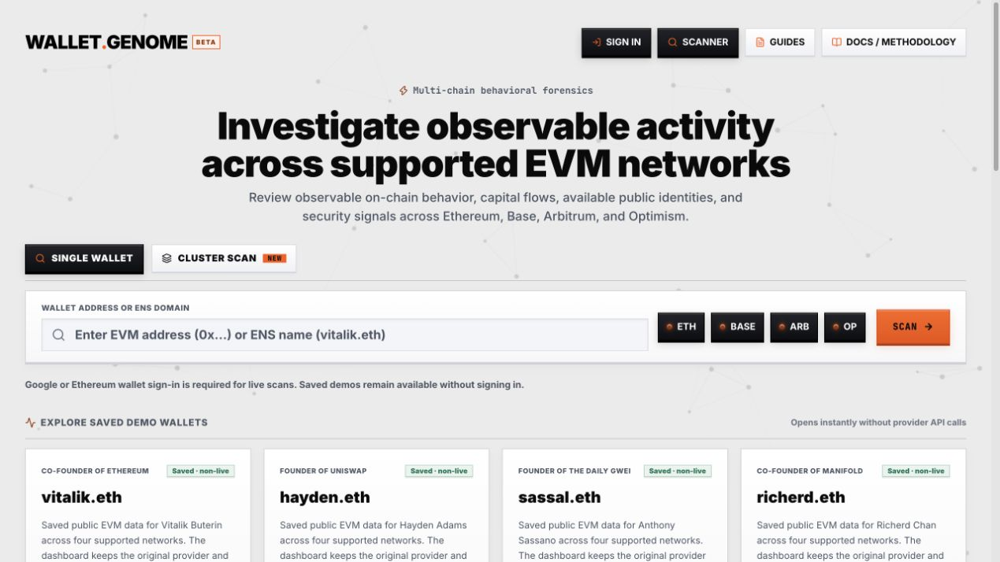
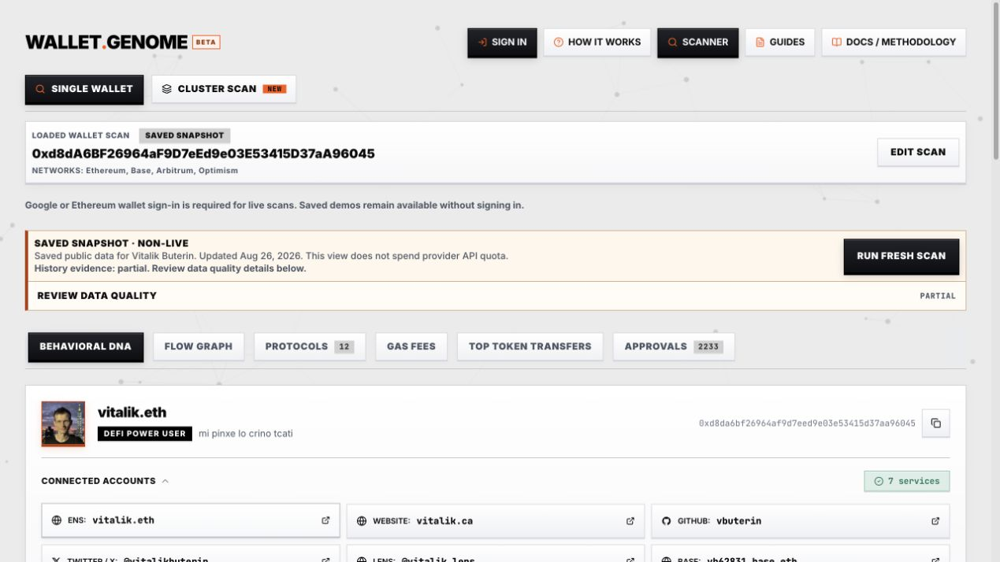
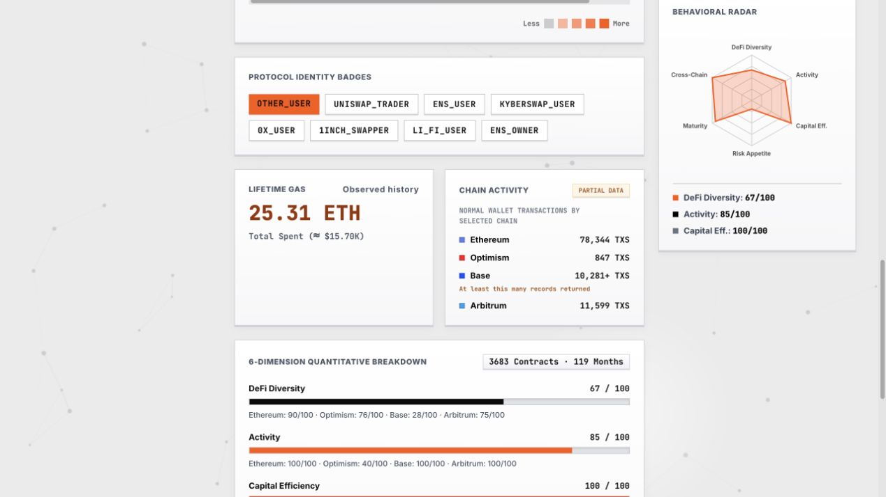
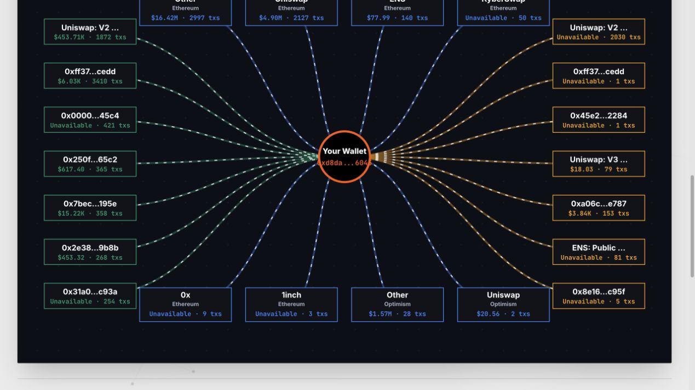
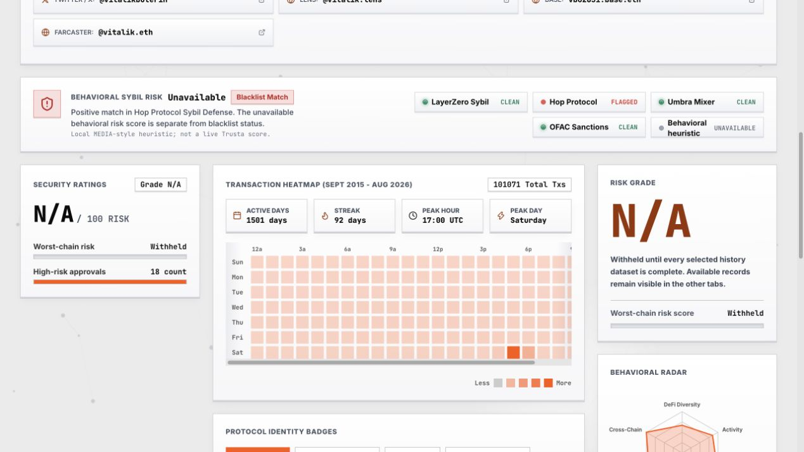

# How to Analyze an EVM Wallet with WalletGenome

*A visual guide to wallet behavior, capital flows, and approval risk across Ethereum, Base, Arbitrum, and Optimism.*

A wallet address can contain years of transactions across several networks. Reading those transactions one by one makes it easy to lose track of the questions that matter: Which applications does the address use? Where do its transfers go? Which approvals deserve a closer look? How much of the history is available?

[WalletGenome](https://www.walletgenome.space/) brings that public activity into a wallet analytics dashboard. It combines behavioral summaries, transfer visualizations, protocol labels, gas analysis, and observed ERC-20 approval states across four supported EVM networks.

This walkthrough shows how to read the dashboard and turn its outputs into useful investigation questions.

*WalletGenome’s scanner supports Ethereum, Base, Arbitrum, and Optimism. Saved demos let readers explore the interface before running a fresh scan.*

## What is WalletGenome?

WalletGenome is a read-only tool for EVM wallet analytics and on-chain forensics. It organizes observable public records around an address, then calculates summaries from the evidence returned by its providers.

Its dashboard lets you explore:

- **Behavioral DNA:** six dimensions of observed wallet activity and a behavioral radar.
- **Flow Graph:** returned transfer relationships, protocol interactions, and counterparties.
- **Protocols:** recognized application activity across selected networks.
- **Gas Fees:** execution costs and patterns in the observed history.
- **Top Token Transfers:** a closer look at returned token movements.
- **Approvals:** reconstructed ERC-20 approval states and available exposure estimates.

The supported scope is Ethereum, Base, Arbitrum, and Optimism. Activity on other networks, private exchange records, and off-chain agreements falls outside that scope.

The screenshots in this article were captured from the public website on September 27, 2026. The report example uses the saved `vitalik.eth` demo dated August 26, 2026. It contains historical public data and partial coverage. The example demonstrates the interface; it makes no finding about the person named in the demo.

## 1. Start with a question and choose your networks

Open the [WalletGenome scanner](https://www.walletgenome.space/) and choose **Single Wallet**. Enter an EVM address or a supported ENS name, then select the relevant networks.

A useful starting question is specific: “Which protocols and recurring counterparties appear in this address’s returned history?” Another is: “Which observed approvals need a current on-chain check?”

That question determines which parts of the report deserve your attention. It also helps you avoid treating every chart as a conclusion.

Fresh scans require sign-in through Google or an Ethereum wallet. Wallet authentication uses a login message. The site states that it requests no transaction or private key. Saved demos can be opened without signing in and load without fresh provider API calls.

## 2. Read the data coverage before the scores

The first useful result is the evidence status.

WalletGenome distinguishes complete, partial, and unavailable datasets. Transaction history can be available while transfer records or historical prices remain incomplete. A chart may therefore show useful observations without supporting a complete account of the wallet’s activity.

*The saved report identifies its date and partial history. Keep that scope attached to every observation taken from the dashboard.*

In this demo, the overall risk grade is withheld because the selected history is incomplete. Available records remain visible for review.

That distinction matters. An unavailable result leaves a question unanswered. Missing prices cannot establish zero exposure, and missing transactions cannot establish inactivity. Even a dataset labeled complete describes the report’s coverage rule rather than everything a wallet owner has ever done.

## 3. Use Behavioral DNA to understand activity patterns

The Behavioral DNA view summarizes DeFi diversity, activity, capital efficiency, risk appetite, maturity, and network breadth. The radar makes the shape of those calculated dimensions easier to compare.

*The radar summarizes model dimensions. The chain activity panel preserves the partial-data label and marks a returned count as a lower bound.*

These dimensions suggest where to investigate next. A wallet with broad network activity raises different questions from one concentrated on a single chain. Protocol badges provide a starting point for checking recognized contract interactions.

The transaction heatmap adds timing context: active days, streaks, and concentrations by day and hour. Its time labels use UTC. A busy hour can help locate an activity burst, but timing alone cannot identify the operator or establish automation.

Behavioral categories describe the model’s reading of returned records. They do not establish a person’s identity, motivation, or future behavior.

## 4. Follow transfer relationships in the Flow Graph

The Flow Graph arranges observed inflow sources, protocol activity, and outflow destinations around the wallet. Network and minimum-volume filters help narrow the view.

*A detail of the saved demo’s flow graph. Some values remain unavailable; the graph reflects returned evidence and selected filters.*

Use it to find recurring counterparties, recognized applications, and transfer paths worth checking in an explorer. A configured protocol label supplies context for an address match. The underlying transaction still determines what happened.

Take particular care with dollar totals. Historically priced transfer volume can count assets as they move repeatedly. It does not establish wallet wealth or trading profit. Where history or pricing is incomplete, WalletGenome labels the priced flow summary as an incomplete lower bound and identifies excluded values.

For a finding you intend to share, retain the chain, transaction hash, timestamp, asset, direction, and counterparty. Those details let another reader check the observation.

## 5. Review approval history and security signals

ERC-20 approvals authorize a spender to move tokens within an allowance. WalletGenome’s approval audit reconstructs the latest non-revoked state observed in returned history for each token and spender pair.

That reconstruction has a practical limit: current allowance state needs a separate live on-chain check. Missing history can hide an approval or a later revocation.

Available exposure estimates use reconstructed positive balances and current prices, with the observed allowance cap applied when finite. Missing balances or prices leave the estimate unavailable.

The security model evaluates configured factors involving approvals, failed transactions, stale approvals, and unidentified contracts. When the required history is complete, the aggregate headline uses the highest selected-chain risk score. Review the contributing records and chain alongside the score.

*The saved demo withholds its overall risk grade. Source-specific list statuses and the behavioral heuristic are separate outputs; none establishes intent or wrongdoing.*

Sybil analysis also needs careful reading. WalletGenome reports configured source-list matches separately from its local MEDIA-style behavioral heuristic. The heuristic is calculated locally rather than retrieved as a live Trusta score. A source match calls for checking the source and its context; a no-match result only describes that particular check.

The [wallet risk signals guide](https://www.walletgenome.space/guides/understanding-wallet-risk-signals) explains these distinctions in more detail.

## A workflow you can reuse

For your next wallet review:

1. Define the question and record the address and selected networks.
2. Check the report date, history coverage, and pricing warnings.
3. Use Behavioral DNA and the heatmap to locate patterns worth examining.
4. Follow recurring counterparties and protocol activity in the Flow Graph.
5. Review approval records and the factors behind available security scores.
6. Verify material observations against their source transactions and record unresolved gaps.

Write the observation before the interpretation. “The returned history contains repeated transfers to this address” gives a reviewer something to verify. Any explanation of why those transfers happened needs additional evidence.

## Explore WalletGenome

Start with a [saved wallet demo](https://www.walletgenome.space/?demo=vitalik) to see how the dashboard handles public records and incomplete evidence. Then use the scanner for your own investigation question.

For a deeper walkthrough, read [How to Analyze an EVM Wallet](https://www.walletgenome.space/guides/how-to-analyze-an-evm-wallet). The [methodology documentation](https://www.walletgenome.space/docs) explains the calculations behind the outputs.

A useful wallet report makes the evidence easier to inspect and the unanswered questions easier to see. WalletGenome gives you a place to begin that review.
